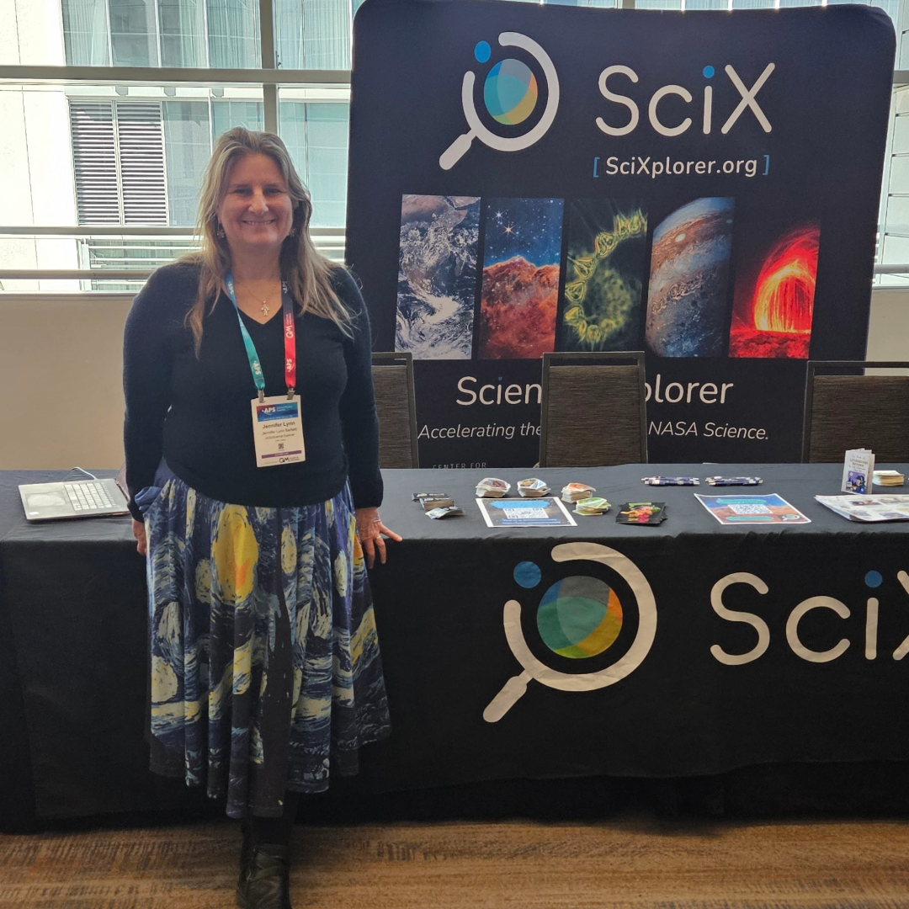

Denver, Colorado, hosted around 14,000 scientists for the American Physical Society's 2026 Global Physics Summit from March 15 through 20.

A mile high and still overflowing with excitement for the latest developments in [astrophysics](https://ui.adsabs.harvard.edu/search/fq=%7B!type%3Daqp%20v%3D%24fq_database%7D&fq_database=(database%3Aastronomy%20OR%20database%3Aphysics)&q=collection%3Aastronomy&sort=date%20desc%2C%20bibcode%20desc&p_=0)astrophysics](https://scixplorer.org/search?p=1&q=collection%3Aastronomy&sort=score+desc&sort=date+desc&d=astrophysics), [gravitational wave detection](https://ui.adsabs.harvard.edu/search/fq=%7B!type%3Daqp%20v%3D%24fq_database%7D&fq_database=database%3Aastronomy&q=abs%3A%22gravitational%20wave%20detection%22&sort=date%20desc%2C%20bibcode%20desc&p_=0)gravitational wave detection](https://scixplorer.org/search?p=1&q=abs%3A%22gravitational+wave+detection%22&sort=score+desc&sort=date+desc&d=general), [geophysics](https://ui.adsabs.harvard.edu/search/q=collection%3Aearthscience&sort=date%20desc%2C%20bibcode%20desc&p_=0)geophysics](https://scixplorer.org/search?p=1&q=collection%3Aearthscience&sort=score+desc&sort=date+desc&d=earth), [exoplanets](https://ui.adsabs.harvard.edu/search/q=abs%3Aexoplanets&sort=date%20desc%2C%20bibcode%20desc&p_=0)exoplanets](https://scixplorer.org/search?p=1&q=abs%3A%22exoplanets%22&sort=score+desc&sort=date+desc&d=planetary), [particle physics](https://ui.adsabs.harvard.edu/search/q=abs%3A%22particle%20physics%22&sort=date%20desc%2C%20bibcode%20desc&p_=0)particle physics](https://scixplorer.org/search?p=1&q=abs%3A%22particle+physics%22&sort=score+desc&sort=date+desc&d=general), [cosmic rays](https://ui.adsabs.harvard.edu/search/q=abs%3A%22cosmic%20rays%22&sort=date%20desc%2C%20bibcode%20desc&p_=0)cosmic rays](https://scixplorer.org/search?p=1&q=abs%3A%22cosmic+rays%22&sort=score+desc&sort=date+desc&d=heliophysics), [plasma physics](https://ui.adsabs.harvard.edu/search/q=abs%3A%22plasma%20physics%22&sort=date%20desc%2C%20bibcode%20desc&p_=0)plasma physics](https://scixplorer.org/search?p=1&q=abs%3A%22plasma+physics%22&sort=score+desc&sort=date+desc&d=general), [soft matter](https://ui.adsabs.harvard.edu/search/q=abs%3A%22soft%20matter%22&sort=date%20desc%2C%20bibcode%20desc&p_=0)soft matter](https://scixplorer.org/search?p=1&q=abs%3A%22soft+matter%22&sort=score+desc&sort=date+desc&d=biophysical), [biosignatures](https://ui.adsabs.harvard.edu/search/q=abs%3A%22biosignatures%22&sort=date%20desc%2C%20bibcode%20desc&p_=0)biosignatures](https://scixplorer.org/search?p=1&q=abs%3Abiosignatures&sort=score+desc&sort=date+desc&d=planetary), and so much more.

[Jennifer Lynn Bartlett](../../about/team/team/jbartlett.html)Jennifer Lynn Bartlett](../../scixabout/team/team/jbartlett.html) was thrilled to spend four days giving demonstrations of [SciX to new users](https://scixplorer.org/home/) and old [ADS friends preparing to transition](https://scixplorer.org/adstoscix/) to the new platform. With the exhibit hall filled to capacity, the SciX booth and NASA [Physics of the Cosmos](https://science.nasa.gov/astrophysics/programs/physics-of-the-cosmos/about/) team set up in the Hyatt Hotel, where sessions on traditional "April" meeting topics were scheduled. Chief Scientist [Brian Humensky](https://www.linkedin.com/in/brian-humensky/) led their team along with public outreach specialist [Stephanie Clark](https://science.nasa.gov/people/stephanie-clark-public-outreach-specialist/). Additional scientists staffed their booth each day. Together, we talked NASA science and open science all day for four days. 

Half our visitors are exploring the boundaries of [high-energy phenomena](https://ui.adsabs.harvard.edu/search/fq=%7B!type%3Daqp%20v%3D%24fq_database%7D&fq_database=database%3Aastronomy&q=arxiv_class%3A(hep-ex%20OR%20hep-lat%20OR%20hep-ph%20OR%20hep-th)&sort=date%20desc%2C%20bibcode%20desc&p_=0)high-energy phenomena](https://scixplorer.org/search?p=1&q=arxiv_class%3A%28hep-ex+OR+hep-lat+OR+hep-ph+OR+hep-th%29&sort=score+desc&sort=date+desc&d=general), [neutrino properties](https://ui.adsabs.harvard.edu/search/fq=%7B!type%3Daqp%20v%3D%24fq_database%7D&fq_database=database%3Aphysics&q=full%3Aneutrino%20collection%3Aphysics&sort=date%20desc%2C%20bibcode%20desc&p_=0)neutrino properties](https://scixplorer.org/search?p=1&q=full%3Aneutrino+collection%3Aphysics&sort=score+desc&sort=date+desc&d=general), [relativistic mechanics](https://ui.adsabs.harvard.edu/search/fq=%7B!type%3Daqp%20v%3D%24fq_database%7D&fq_database=database%3Aphysics&q=full%3A%22relativistic%20mechanics%22%20abs%3A(%22general%20relativity%22%20OR%20%22special%20relativity%22%20OR%20%22GR%22%20OR%20%22SR%22)%20collection%3Aphysics&sort=date%20desc%2C%20bibcode%20desc&p_=0)relativistic mechanics](https://scixplorer.org/search?p=1&q=full%3A%22relativistic+mechanics%22+abs%3A%28%22general+relativity%22+OR+%22special+relativity%22+OR+%22GR%22+OR+%22SR%22%29+collection%3Aphysics&sort=score+desc&sort=date+desc&d=general), and quantum dynamics; each was pleasantly surprised to see what [they could find with ADS, which is becoming SciX](https://ui.adsabs.harvard.edu/search/fl=identifier%2C%5Bcitations%5D%2Cabstract%2Cauthor%2Cauthor_count%2Cbook_author%2Corcid_pub%2Cpublisher%2Corcid_user%2Corcid_other%2Cbibcode%2Ccitation_count%2Ccomment%2Cdoi%2Cid%2Ckeyword%2Cpage%2Cproperty%2Cpub%2Cpub_raw%2Cpubdate%2Cpubnote%2Cread_count%2Ctitle%2Cvolume%2Cdatabase%2Clinks_data%2Cesources%2Cdata%2Ccitation_count_norm%2Cemail%2Cdoctype%2C%5Bfields%20author%3D4%5D%2C%5Bfields%20aff%3D4%5D%2C%5Bfields%20orcid_pub%3D4%5D%2C%5Bfields%20orcid_user%3D4%5D%2C%5Bfields%20orcid_other%3D4%5D&q=collection%3A(physics%20OR%20general)&rows=25&sort=date%20desc%2C%20bibcode%20desc&start=0&ui_tag=results%2Fprimary&p_=0)they could find with SciX](https://scixplorer.org/search?p=1&q=collection%3A%28physics+OR+general%29&sort=score+desc&sort=date+desc&d=general).

Glen Bennett said, "I'm glad <strong>it's free</strong>...very hard to access this otherwise without [institutional] resources."

Another quarter of our visitors are undergraduate students, and even a few high school students, just starting their research journeys and discovering what excites them most; each was delighted with how [easy SciX makes searching](https://ads.harvard.edu/handouts/SciX_litreview_booklet.pdf) the scholarly literature. Swastika Acharjee of the University of Minnesota said, <mark>"What an exciting project!"</mark> while bringing her own high-energy positivity at the end of the day. A Novi High School student who wants to gamify the collecting and sharing of [urban environmental science data](https://ui.adsabs.harvard.edu/search/q=property%3Adata%20abs%3A(%22environmental%20science%22%20AND%20%22urban%22)&sort=date%20desc%2C%20bibcode%20desc&p_=0)urban environmental science data](https://scixplorer.org/search?d=general&p=1&q=property%3Adata+abs%3A(%22environmental+science%22+AND+%22urban%22)&sort=score+desc&sort=date+desc) was especially interested in learning about open science data repositories and [how ADS links to them](https://ui.adsabs.harvard.edu/search/q=property%3Adata&sort=date%20desc%2C%20bibcode%20desc&p_=0)how SciX links to them](https://scixplorer.org/search?p=1&q=property%3Adata&sort=score+desc&sort=date+desc&d=general).

Current ADS users were relieved to learn that they can change over to the [new interface with minimal disruption](https://scixplorer.org/adstoscix/quick-start) to their current workflow while enjoying new features, like a mobile friendly interface and searchable filters. Some, like [Naaz Shafeer Vemmerath Kulangara](https://naazshafeer.github.io/) of the University of Southern California, picked up some additional tips, [like visualizations,](https://ads.harvard.edu/handouts/ADS_visualizations_handout.pdf) to assess new literature more efficiently. 

"I've been using [alternative source] to read new papers but I think I'll use SciX now; <strong>it has better tools and interface.</strong>"

 

A few, like science journalist [Liz Kruesi](https://www.lizkruesi.com/), were interested in the SciX historical literature, which [extends to 1581](https://ui.adsabs.harvard.edu/search/fq=%7B!type%3Daqp%20v%3D%24fq_database%7D&fq_database=(database%3Aastronomy%20OR%20database%3Aphysics)&q=year%3A1581&sort=date%20desc%2C%20bibcode%20desc&p_=0)extends to 1581](https://scixplorer.org/search?p=1&q=year%3A1581&sort=score+desc&sort=date+desc&d=general) and includes [over 135,000 physics items before 1930](https://ui.adsabs.harvard.edu/search/fq=%7B!type%3Daqp%20v%3D%24fq_database%7D&fq_database=database%3Aphysics&q=collection%3Aphysics%20year%3A1581-1929&sort=date%20desc%2C%20bibcode%20desc&p_=0)over 135,000 physics items before 1930](https://scixplorer.org/search?p=1&q=collection%3Aphysics+year%3A1581-1929&sort=score+desc&sort=date+desc&d=general). She "love[s] this new tool with [StarGlass](https://starglass.cfa.harvard.edu/)" that [connects astronomical photographic plate observations](https://ui.adsabs.harvard.edu/search/q=data%3Astarglass&sort=date%20desc%2C%20bibcode%20desc&p_=0)connects astronomical photographic plate observations](https://scixplorer.org/search?p=1&q=data%3Astarglass&sort=score+desc&sort=date+desc&d=general) to published papers and scanned notebooks so that the [connections among historical research](https://ui.adsabs.harvard.edu/abs/2026AAS...24727204B/abstract)connections among historical research](https://scixplorer.org/abs/2026AAS...24727204B/abstract) products can be as rich as the modern links. 

Of course, SciX excitement is only rivaled by delight at the SciX logo stickers and literature designed by SciX Lead Ambassador and PhD student at UC Irvine, [Yueyi Che](../../about/ambassador/team/Che.html)Yueyi Che](../../scixabout/ambassador/team/Che.html). 

Jennifer also presented two posters, in-person and online. "Exploring the Physics Literature with the Science Explorer" dove into our extensive physics collection and highlighted ways physicists could use SciX. "Science Explorer: Next-Generation Access to ADS and All NASA Science" focused on assisting ADS users shift to SciX and make the most of this opportunity by learning a new feature or two. Attendees can access these resources in the APS app through June 18. After that, you will be able to find the files in the [Science Explorer Community on Zenodo](https://zenodo.org/communities/scixcommunity/records?q=&l=list&p=1&s=10&sort=newest). SciX receives [APS conference abstracts](https://ui.adsabs.harvard.edu/search/q=pub%3A(%22APS%20March%20Meeting%20Abstracts%22%20OR%20%22APS%20April%20Meeting%20Abstracts%22%20OR%20%22APS%20Meeting%20Abstracts%22)&sort=date%20desc%2C%20bibcode%20desc&p_=0)APS conference abstracts](https://scixplorer.org/search?p=1&q=pub%3A%28%22APS+March+Meeting+Abstracts%22+OR+%22APS+April+Meeting+Abstracts%22+OR+%22APS+Meeting+Abstracts%22%29&sort=score+desc&sort=date+desc&d=general) yearly; we expect to receive the 2025 APS Global Physics Summit shortly.

  

<h3 style="margin-top: 0; color: #5FBFAE;">Looking Ahead</h3>

With deepest gratitude to <a href="https://www.linkedin.com/in/cookedan/">Dan Cooke</a> and all the <a href="https://www.aps.org/">American Physical Society</a> staff who make the Global Physics Summit possible, our science is stronger when it is open and when it is shared.

We hope to see you in Vienna for the <a href="https://egu26.eu/">European Geosciences Union General Assembly</a> at the beginning of May. Until then, happy Spring!

