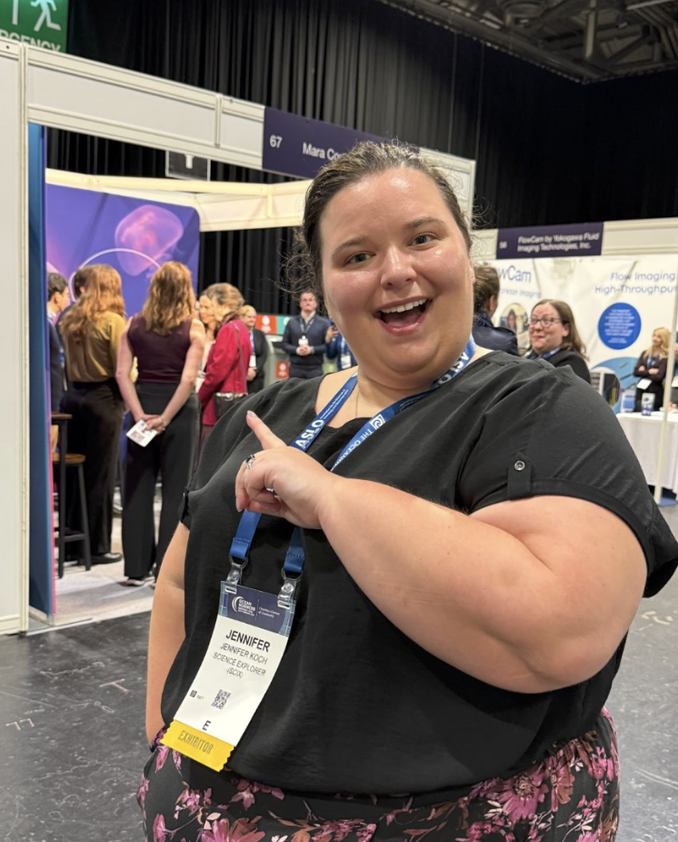
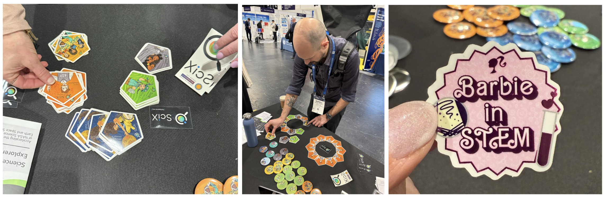
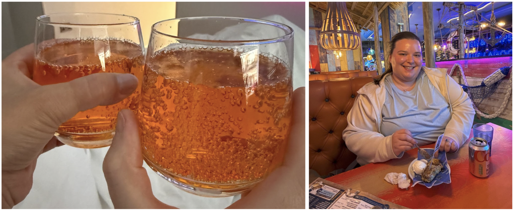
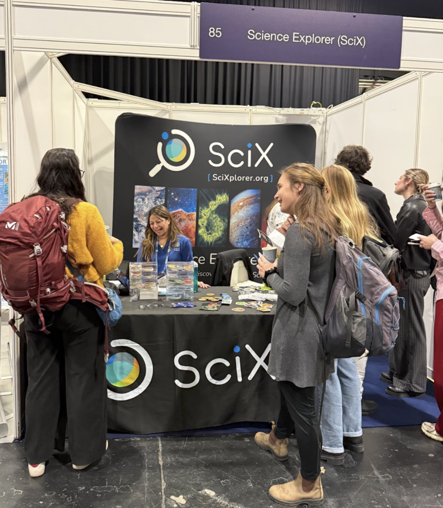

Denver, Colorado, hosted around 14,000 scientists for the American Physical Society's 2026 Global Physics Summit from March 15 through 20. A mile high and still overflowing with excitment for the latest developments in [astrophysics](https://ui.adsabs.harvard.edu/search/fq=%7B!type%3Daqp%20v%3D%24fq_database%7D&fq_database=(database%3Aastronomy%20OR%20database%3Aphysics)&q=collection%3Aastronomy&sort=date%20desc%2C%20bibcode%20desc&p_=0)astrophysics](https://scixplorer.org/search?p=1&q=collection%3Aastronomy&sort=score+desc&sort=date+desc&d=astrophysics), [gravitational wave detection](https://ui.adsabs.harvard.edu/search/fq=%7B!type%3Daqp%20v%3D%24fq_database%7D&fq_database=database%3Aastronomy&q=abs%3A%22gravitational%20wave%20detection%22&sort=date%20desc%2C%20bibcode%20desc&p_=0)gravitational wave detection]((https://scixplorer.org/search?p=1&q=abs%3A%22gravitational+wave+detection%22&sort=score+desc&sort=date+desc&d=general)), [geophysics](https://ui.adsabs.harvard.edu/search/q=collection%3Aearthscience&sort=date%20desc%2C%20bibcode%20desc&p_=0)geophysics](https://scixplorer.org/search?p=1&q=collection%3Aearthscience&sort=score+desc&sort=date+desc&d=earth), [exoplanets](https://ui.adsabs.harvard.edu/search/q=abs%3Aexoplanets&sort=date%20desc%2C%20bibcode%20desc&p_=0)exoplanets](https://scixplorer.org/search?p=1&q=abs%3A%22exoplanets%22&sort=score+desc&sort=date+desc&d=planetary), [particle physics](https://ui.adsabs.harvard.edu/search/q=abs%3A%22particle%20physics%22&sort=date%20desc%2C%20bibcode%20desc&p_=0)particle physics](https://scixplorer.org/search?p=1&q=abs%3A%22particle+physics%22&sort=score+desc&sort=date+desc&d=general), [cosmic rays](https://ui.adsabs.harvard.edu/search/q=abs%3A%22cosmic%20rays%22&sort=date%20desc%2C%20bibcode%20desc&p_=0)cosmic rays](https://scixplorer.org/search?p=1&q=abs%3A%22cosmic+rays%22&sort=score+desc&sort=date+desc&d=heliophysics), [plasma physics](https://ui.adsabs.harvard.edu/search/q=abs%3A%22plasma%20physics%22&sort=date%20desc%2C%20bibcode%20desc&p_=0)plasma physics](https://scixplorer.org/search?p=1&q=abs%3A%22plasma+physics%22&sort=score+desc&sort=date+desc&d=general), [soft matter](https://ui.adsabs.harvard.edu/search/q=abs%3A%22soft%20matter%22&sort=date%20desc%2C%20bibcode%20desc&p_=0)soft matter](https://scixplorer.org/search?p=1&q=abs%3A%22soft+matter%22&sort=score+desc&sort=date+desc&d=biophysical), [biosignatures](https://ui.adsabs.harvard.edu/search/q=abs%3A%22biosignatures%22&sort=date%20desc%2C%20bibcode%20desc&p_=0))biosignatures](https://scixplorer.org/search?p=1&q=abs%3Abiosignatures&sort=score+desc&sort=date+desc&d=planetary), and so much more.

[Jennifer Lynn Bartlett](../../about/team/team/jbartlett.html)Jennifer Lynn Bartlett](../../scixabout/team/team/jbartlett.html) was thrilled to spend four days giving demonstrations of [SciX to new users](https://scixplorer.org/home/) and old [ADS friends preparing to transition](https://scixplorer.org/adstoscix/) to the new platform. Of course, SciX excitement is only rivaled by delight at the SciX logo stickers and literature designed by SciX Lead Ambassador and PhD student at UC Irvine, [Yueyi Che](../../about/ambassador/team/Che.html)Yueyi Che](../../scixabout/ambassador/team/Che.html). 

- Half our visitors are exploring the boundries of [high-energy phenomena](https://ui.adsabs.harvard.edu/search/fq=%7B!type%3Daqp%20v%3D%24fq_database%7D&fq_database=database%3Aastronomy&q=arxiv_class%3A(hep-ex%20OR%20hep-lat%20OR%20hep-ph%20OR%20hep-th)&sort=date%20desc%2C%20bibcode%20desc&p_=0)high-energy phenomena](https://scixplorer.org/search?p=1&q=arxiv_class%3A%28hep-ex+OR+hep-lat+OR+hep-ph+OR+hep-th%29&sort=score+desc&sort=date+desc&d=general), [neutrino properties](https://ui.adsabs.harvard.edu/search/fq=%7B!type%3Daqp%20v%3D%24fq_database%7D&fq_database=database%3Aphysics&q=full%3Aneutrino%20collection%3Aphysics&sort=date%20desc%2C%20bibcode%20desc&p_=0)neutrino properties](https://scixplorer.org/search?p=1&q=full%3Aneutrino+collection%3Aphysics&sort=score+desc&sort=date+desc&d=general), [relativistic mechanics](https://ui.adsabs.harvard.edu/search/fq=%7B!type%3Daqp%20v%3D%24fq_database%7D&fq_database=database%3Aphysics&q=full%3A%22relativistic%20mechanics%22%20abs%3A(%22general%20relativity%22%20OR%20%22special%20relativity%22%20OR%20%22GR%22%20OR%20%22SR%22)%20collection%3Aphysics&sort=date%20desc%2C%20bibcode%20desc&p_=0)relativistic mechanics](https://scixplorer.org/search?p=1&q=full%3A%22relativistic+mechanics%22+abs%3A%28%22general+relativity%22+OR+%22special+relativity%22+OR+%22GR%22+OR+%22SR%22%29+collection%3Aphysics&sort=score+desc&sort=date+desc&d=general), and quantum dynamics; each was pleasantly surprised to see what [they could find with ADS, which is becoming SciX](https://ui.adsabs.harvard.edu/search/fl=identifier%2C%5Bcitations%5D%2Cabstract%2Cauthor%2Cauthor_count%2Cbook_author%2Corcid_pub%2Cpublisher%2Corcid_user%2Corcid_other%2Cbibcode%2Ccitation_count%2Ccomment%2Cdoi%2Cid%2Ckeyword%2Cpage%2Cproperty%2Cpub%2Cpub_raw%2Cpubdate%2Cpubnote%2Cread_count%2Ctitle%2Cvolume%2Cdatabase%2Clinks_data%2Cesources%2Cdata%2Ccitation_count_norm%2Cemail%2Cdoctype%2C%5Bfields%20author%3D4%5D%2C%5Bfields%20aff%3D4%5D%2C%5Bfields%20orcid_pub%3D4%5D%2C%5Bfields%20orcid_user%3D4%5D%2C%5Bfields%20orcid_other%3D4%5D&q=collection%3A(physics%20OR%20general)&rows=25&sort=date%20desc%2C%20bibcode%20desc&start=0&ui_tag=results%2Fprimary&p_=0)they could find with SciX](https://scixplorer.org/search?p=1&q=collection%3A%28physics+OR+general%29&sort=score+desc&sort=date+desc&d=general). Glen Bennett said, "I'm glad **it's free**...very hard to access this otherwise without [institutional] resources."
- Another quarter of our visitors are undergraduate student just starting their research journeys and discovering what excites them most; each was delighted with how easy SciX makes searching the scholarly literature.
- ADS users were releaved to learn that they can change over to the new interface with minimal disruption to their current workflow.  

arrived at OSM armed with demos of the platform, flashy SciX badges, and an unreasonable amount of enthusiasm. What followed was four days of near-constant conversation with oceanographers, climate scientists, ecosystem modellers, remote sensing experts, and early-career researchers mapping out futures as vast as the Atlantic itself.

From coral reefs off Madagascar to atmospheric data captured from space, the science on show was breathtaking. We chatted with researchers tracking coastal resilience, modelling ice sheet dynamics, exploring biogeochemical cycles, and using satellite data to understand how our planet is changing in real time.

One of the joys of OSM is that it truly is interdisciplinary — physical oceanographers rubbing shoulders with marine biologists, climate scientists collaborating with technologists. That spirit of connection was everywhere.

Claudette Proctor from Stanford's School of Sustainability summed up her experience beautifully:

"This is like [another major search platform], except it is actually useful. <strong>I will be using this tool every day</strong>."

 
Kayla Ellerbe from the University of Miami was excited about how research networks come to life:

"Very easy to work with and gives an enormous amount of information that can connect papers based on authors, keywords, and institutions."

 

Bryan Wilson, who explores rare coral reefs off the coast of Madagascar, was delighted to find a platform that supports his interdisciplinary work — particularly the ability to link NASA's ECOSTRESS data with other published research. When you're bridging ecosystems, climate science, and remote sensing, those connections aren't just helpful — they're transformative!

OSM also delivered some unforgettable moments beyond the science. We had a brush with royalty when Princess Anne visited booths near ours — a slightly surreal moment in an already extraordinary week. And then, in what can only be described as peak ocean conference energy, we came face to face with [Boaty McBoatface](https://noc.ac.uk/education/boaty-mcboatface). Yes. That Boaty McBoatface. Ocean royalty indeed!

As always, a big highlight for all our booth visitors was the beautiful array of stickers and button badges designed by SciX Lead Ambassador and PhD student at UC Irvine, [Yueyi Che](../../about/ambassador/team/Che.html)Yueyi Che](../../scixabout/ambassador/team/Che.html). We ran out of our exclusive, hot-off-the-press ocean science button badges before lunchtime on Tuesday, but we had plenty of other scientists for people to collect.

We even gained some additional "Barbie in STEM" stickers from researcher Mackenzie Eckles from CSU Monterey Bay, who had some spares from her poster presentation and thought we were the organisation best aligned with her personal brand of science-for-all! Thanks for thinking of us, Mackenzie — the stickers were as popular as our own ones.

Naturally, we leaned into Glasgow's cultural heritage too. Jenny bravely tried her first deep-fried Mars Bar — a scientific experiment in its own right — while Suze fully committed to the local favourite, Irn-Bru, in quantities that may require further peer review.

<h3 style="margin-top: 0; color: #5FBFAE;">Reflections</h3>

What will stay with us most are the conversations. Early-career researchers excited about discovering potential collaborators. Scientists thrilled to break out of disciplinary silos. Teams eager to connect datasets from fieldwork, satellites, and laboratory analysis into something bigger than the sum of its parts.

OSM 2026 reminded us that ocean science doesn't exist in isolation. It spans coastlines and continents, institutions and industries. Glasgow, thank you for the science, the stories, and the sugar highs. We'll see you next at APS later this month!

