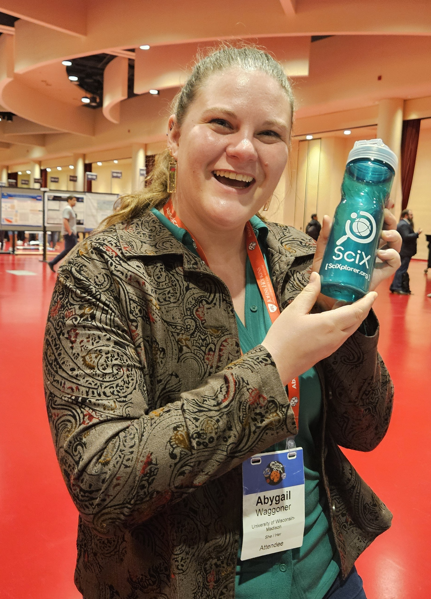
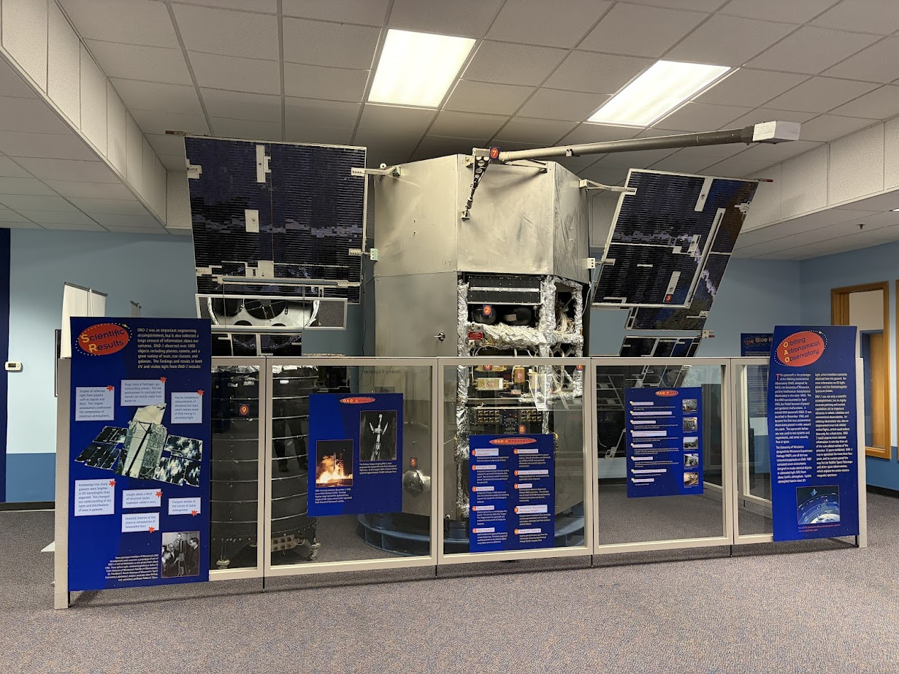
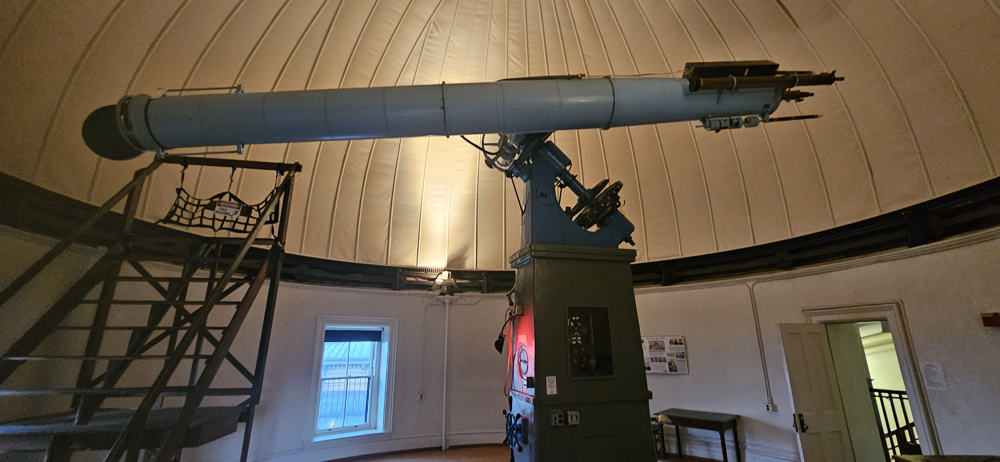
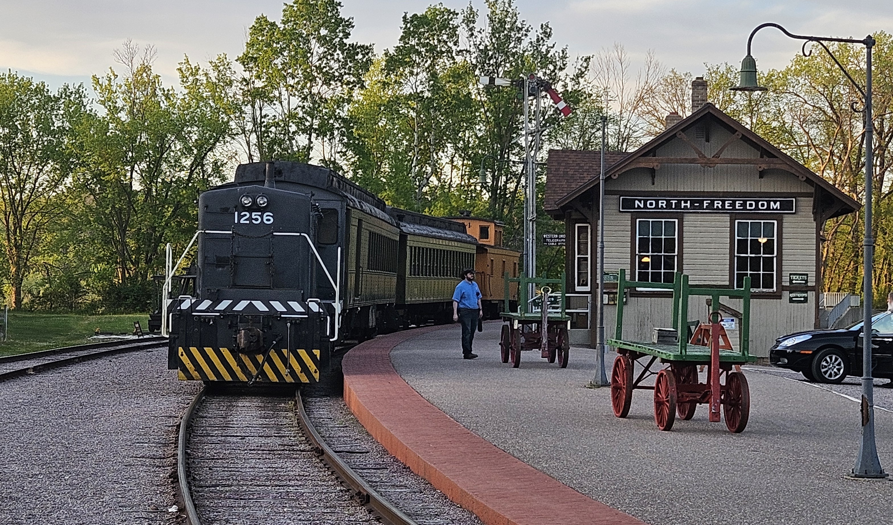

On May 17, the [Astrobiology Science Conference (AbSciCon) 2026](https://www.agu.org/abscicon) opened with a roll call of who had attended which meeting harking back to the first meeting in 2000 at NASA's Ames Research Center, California. Held approximately every two years, attendance has grown from approximately 650 to 800 scientists. This year's meeting in [Madison, Wisconsin](https://www.cityofmadison.com/) included second-time attendee Jennifer Lynn Bartlett[Jennifer Lynn Bartlett](../../scixabout/team/team/jbartlett.html), Project Scientist for Astrophysics, and first-time attendee Jennifer Koch[Jennifer Koch](../../scixabout/team/team/jkoch.html), Digital Technologies Development Librarian.

The earliest use of *astrobiology* captured by *Oxford English Dictionary* (OED) appears in an 1898 advertisement for *The Flaming Sword,* a periodical that we will not be recommending for inclusion in the [Science Explorer (SciX)](https://scixplorer.org/). For its familiar sense of the scientific investigation of life in the Universe, the OED cites a 1941 Astronomical Society of the Pacific leaflet[1941 Astronomical Society of the Pacific leaflet](https://scixplorer.org/abs/1941ASPL....3..333L/abstract); it's the earliest appearance of the term in ADS[appearance of the term in SciX](https://scixplorer.org/search?d=planetary&p=1&q=%3Dfull%3Aastrobiology&sort=date+asc&sort=date+desc) as well. 

Addressing the questions astrobiologists pose requires resources from multiple disciplines: biology, chemistry, geology, astronomy, celestial mechanics, and planetary science. Meeting that need, SciX is designed to be a multidisciplinary digital library with tools to help researchers find relevant and useful articles, reports, data sets, and software across all of NASA science. Our "greedy" curation model["greedy" curation model](https://scixplorer.org/scixblog/curation-model) pulls in lots of peripheral material that is helpful in understanding items in our core collections. Our "100% real human" curators also take recommendations from users of items that they would like to see indexed.

During the three days that the exhibit hall was open, the Jennifers welcomed an amazing array of scientists to the SciX booth. Many came for demonstrations of the library and stayed to chat about the fascinating projects that motivate them. So many conversations moved from "SciX? What's that?" to "This is so cool! I'm definitely going to use this." Among these conversations, they especially recall 
- Planetary geoscientist and pilot [Sydney Clouthier (Purdue)](https://www.linkedin.com/in/sydney-cloutier/)
- Molecular biologist and amateur entomologist [Kaelyn Calma (Univ. TX Rio Grande Valley)](https://www.researchgate.net/profile/Kaelyn-Calma)
- Astrochemist and spectroscopist [Akant Vats](https://www.linkedin.com/in/akant-vats-3404b0252/) 0000-0001-9923-5659[0000-0001-9923-5659](https://scixplorer.org/search?p=1&q=orcid%3A%220000-0001-9923-5659%22&sort=date+desc&d=planetary); NASA Ames)

Planetary scientist, analog astronaut, and aspiring author of children's books [Émilie Laflèche (0000-0002-8041-3184; Purdue)](https://www.linkedin.com/in/emilie-lafleche-6b892699/) tempered her excitement about using SciX in the future with disappointment that she had not known about it when she was doing the literature search for her dissertation. Now, that she does know about it, we look forward to seeing more of her work[more of her work](https://scixplorer.org/search?d=planetary&p=1&q=(author%3A%22Lafleche%2C+Emilie%22+AND+Inst%3A%22Purdue+U%22)+OR+orcid%3A%220000-0002-8041-3184%22&sort=score+desc&sort=date+desc).

In addition to the SciX booth, the Jennifers presented "Science Explorer (SciX): Supporting Open and Interdisciplinary Science" as a [physical](https://doi.org/10.5281/zenodo.20536390) and [iPoster](https://abscicon26.ipostersessions.com/default.aspx?s=F3-BA-94-73-18-67-96-F3-2F-FC-CA-6F-06-8E-C6-44&guestview=true) on Tuesday afternoon, May 19. Part of the small session on "Best Practices for Implementing Open Science in Astrobiology," it highlighted SciX as "developed by scientists for scientists." It also discusses our collaboration[our collaboration](https://scixplorer.org/scixblog/astrobiology-collab) with [NASA Astrobiology](https://science.nasa.gov/astrobiology/) to build a [publications library](https://science.nasa.gov/astrobiology/researchers/publications/) that makes astrobiology research more easily findable. They have submitted a copy of the physical poster to [ESS Open Archive](https://essopenarchive.org/); the other files are available in the [Science Explorer Community on Zenodo](https://zenodo.org/communities/scixcommunity/records?q=&l=list&p=1&s=10&sort=newest). SciX will receive all the abstracts from this meeting and has those from several previous events[several previous events](https://scixplorer.org/search?d=planetary&p=1&q=bibstem%3Aabsc.conf&sort=score+desc&sort=date+desc). 

<h3 style="margin-top: 0; color: #5FBFAE;">Side Quests</h3>

While we were in town, Bartlett also presented at the University of Wisconsin-Madison about the [transition from the Astrophysics Data System (ADS) to the Science Explorer](https://scixplorer.org/adstoscix/): once to the [physical science librarians](https://www.library.wisc.edu/people/pset-team/) and twice to members of the [Astronomy Department](https://www.astro.wisc.edu/). Some members of the Astronomy Department met with her both places, including astrochemist [Abygail "Abby" Waggoner](https://www.abygailrwaggoner.com/home). She confessed that she had been skeptical of the new system but now "quite excited. It's going to be good." Historian and astronomer James "Jim" Lattis[James "Jim" Lattis (U Wisconsin-Madison)](https://scixplorer.org/search?d=planetary&fq=%7B%21type%3Daqp+v%3D%24fq_aff%7D&fq_aff=(aff_facet_hier%3A%220%5C%2FU+WI+Madison%22)&p=1&q=author%3A%22lattis%2C+james%22&sort=score+desc&sort=date+desc) generously arranged these talks. Many thanks for the assistance.

The Astronomy Department has now closed its [Space Place](https://www.dailycardinal.com/article/2026/04/uw-astronomy-outreach-center-closes-due-to-budget-cuts) outreach center. Bartlett visited on its last open house to review the artifacts and remaining educational materials. The [Wisconsin Historical Society](https://www.wisconsinhistory.org/) has accepted most of the instruments and displays. However, finding a home for the [Orbiting Astronomical Observatory (OAO)](https://science.nasa.gov/mission/oao/) engineering model is a bigger challenge. Stargazer (OAO-2)[Stargazer (OAO-2)](https://scixplorer.org/search?d=planetary&fq=%7B%21type%3Daqp+v%3D%24fq_database%7D&fq_database=(database%3A%22astronomy%22)&p=1&q=%3Dfull%3A(%22OAO-2%22+OR+%22OAO+2%22+OR+%22Orbiting+Astronomical+Observatory+2%22)+OR+%3Dfull%3A(%22Stargazer%22+AND+%22space+telescope%22)&sort=score+desc&sort=date+desc) launched on December 7, 1968 and Copernicus (OAO-3)[Copernicus (OAO-3)](https://scixplorer.org/search?d=planetary&fq=%7B%21type%3Daqp+v%3D%24fq_database%7D&fq_database=(database%3A%22astronomy%22)&p=1&q=%3Dfull%3A(%22OAO-3%22+OR+%22OAO+3%22+OR+%22Orbiting+Astronomical+Observatory+3%22)+OR+%3Dfull%3A(%22Copernicus%22+AND+%22space+telescope%22)&sort=score+desc&sort=date+desc) launched on August 21, 1972. These space telescopes are the precursors to NASA's current fleet of space telescopes used by astrobiologists today. 

Since April 1881, the [Washburn Observatory](https://wisconsinengineer.com/2023/12/14/an-investment-in-the-future-the-legacy-of-the-washburn-observatory/) has opened its doors to the public on the first and third Wednesdays of every month, [weather permitting](https://www.astro.wisc.edu/outreach/washburn/). Despite cloudy skies, Bartlett paid her respects to the 15.6-inch refractor made by Alvan Clark & Sons in 1879. The observatory was productive in research[observatory was productive in research](https://scixplorer.org/search?d=planetary&p=1&q=bibstem%3A(PWasO+OR+CoWas)&sort=score+desc&sort=date+desc) until superseded in 1958 by Pine Bluff Observatory about 15 miles west. The Joel Stebbins' (1878-1966)[Joel Stebbins' (1878-1966)](https://scixplorer.org/abs/1966PASP...78..214K/abstract) photometric mapping[photometric mapping](https://scixplorer.org/search?d=planetary&fq=%7B%21type%3Daqp+v%3D%24fq_author%7D&fq_author=(%2A%3A%2A+NOT+author_facet_hier%3A%221%5C%2FStebbins%2C+J%5C%2FStebbins%2C+J++P%22)&p=1&q=author%3A%22stebbins%2C+joel%22+year%3A1898-1968&sort=score+desc&sort=date+desc) of interstellar reddening brought a quantitative approach to studying the interstellar medium and enabled an accurate estimate of the diameter of our Milky Way Galaxy[accurate estimate of the diameter of our Milky Way Galaxy](https://scixplorer.org/abs/2014JAHH...17..240L/abstract), fundamental work that can be appreciated by astrobiologists and astrochemists today. Washburn Observatory continues to be used for education and outreach.

Having started her career as an engineer, Bartlett headed farther afield to [North Freedom, Wisconsin](https://vonf.wi.gov/) to the [Mid-continent Railway Museum](https://www.midcontinent.org/) to assist the [Madison Astronomical Society](https://www.madisonastro.org/) with the Starliner star party. The plan was to ride a refurbished historical train to a dark site on the prairie for some stargazing. But as every observational astronomer knows, you are always at the mercy of the weather. Attendees who were paying close attention saw [Venus and Jupiter](https://apod.nasa.gov/apod/ap230227.html) through the [clouds](https://apod.nasa.gov/apod/ap250817.html) and a smattering of other bright stars, including [Alkaid, Mizar, and Alioth in the handle of the Big Dipper](https://apod.nasa.gov/apod/ap231210.html). However, sharing one's science is never a bad way to spend a Saturday night. Furthermore, the convenient zone time we use to coordinate meetings with colleagues across the United States is a legacy of the railroads. 

<h3 style="margin-top: 0; color: #5FBFAE;">Looking Forward</h3>

But first, the Jennifers express their gratitude to the AbSciCon 2026 Scientific Organizing Committee, especially [Nicolle Zellner (Albion College)](https://www.albion.edu/bio/nicolle-zellner/) for all the effort that we did not see but was essential to make this an engaging and welcoming meeting for every discipline within the astrobiology community. Also, they appreciate [Michael Tuite (Blue Marble)](https://www.linkedin.com/in/michael-tuite-893626191/) and [Svetlana Shokolyar Neveu (U Maryland College Park)](https://www.linkedin.com/in/svetlana-shkolyar-neveu-8b96194/) for convening the [open science](https://science.nasa.gov/open-science/) session.

Bartlett will be at the [American Astronomical Society Meeting 248](https://aas.org/meetings/aas248) in Pasadena, California from 14 to 18 June. The Madison Astronomical Society also invited her to return to give a talk to their members in June 2028.

SciX will have a booth at the European Astronomical Society Meeting in Lausanne, Switzerland from 29 June to 3 July. Alberto Accomazzi[Alberto Accomazzi](https://scixplorer.org/scixabout/team/team/aaccomazzi.html), Principal Investigator, and Kelly Lockhart[Kelly Lockhart](https://scixplorer.org/scixabout/team/team/klockhart.html), Technical Lead, will be there. 

We hope to see you at one of these events.

