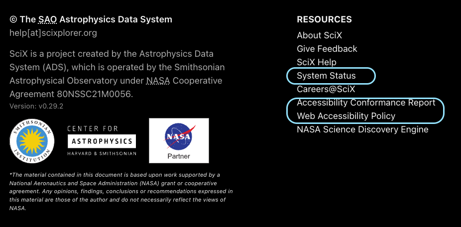
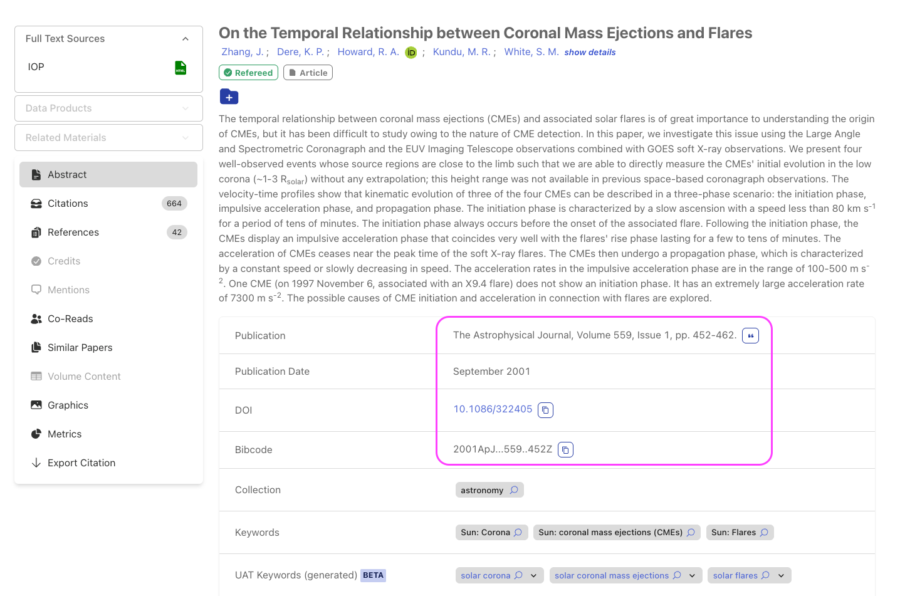
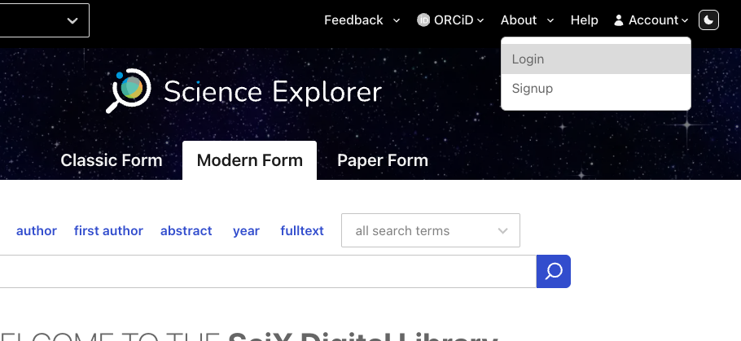

  

    <h2>SciX Quick Start</h2>
  

  

    

      

        <h3>SciX has so many options, but I don’t have time to learn a new system today. How can I get the results I need NOW?</h3>
        +
      

      

      
SciX is designed to provide a disciplinary focus within a multidisciplinary environment. Astronomers can use the language and conventions that are comfortable to us while searching a broader range of materials.  We have been benefiting from this larger collection while using the ADS website through access to increased citations and references. Eventually, you will probably want to take advantage of the full power of SciX to support your research. In the meantime, choose your preferred SciX experience to get started.

      

        

          ›
          It’s never gotten better than ADS Classic!
        

        

          
On the <a href="http://SciXplorer.org" target="_blank">SciXplorer.org</a> main search page, in the upper left corner, select “Astrophysics” from the disciplinary dropdown menu.

          
When you select a discipline, certain features of the SciX interface will be tailored for your discipline. Most importantly, the astrophysics interface is the only one that offers the three tab ADS-like search bar that includes the Classic option. In addition, materials from <a href="https://www.scixplorer.org/scixhelp/search-scix/filter" target="_blank">collections</a> associated with your discipline will be prioritized in your search results. You can change your disciplinary choice at any time.

          
On the main search page, from the central tabs above the search bar itself, select the leftmost “Classic Form” tab.

          
The SciX Classic form is almost identical to the ADS Classic Form tab. The <a href="https://www.scixplorer.org/scixhelp/search-scix/search-syntax" target="_blank">Author</a> and <a href="https://www.scixplorer.org/scixhelp/search-scix/search-syntax" target="_blank">Object</a> boxes are now full width and stacked above one another rather than half-width and side by side. The <a href="https://www.scixplorer.org/scixhelp/search-scix/search-syntax" target="_blank">Publications</a> menu is updated but provides the same functionality.Below the blue Submit query button, you will see the generated fielded query that you would have otherwise have typed into the main search bar on the Modern Form.

        

      

      

        

          ›
          I’m content with ADS Modern.
        

        

          
On the <a href="http://SciXplorer.org" target="_blank">SciXplorer.org</a> main search page, in the upper left corner, select “Astrophysics” from the disciplinary dropdown menu.

          
When you select a discipline, materials from <a href="https://www.scixplorer.org/scixhelp/search-scix/filter" target="_blank">collections</a> associated with your discipline will be prioritized in your search results.  In addition, other features of the SciX interface will be tailored for your discipline.  For instance, when you have astrophysics selected, the <a href="https://www.scixplorer.org/scixhelp/search-scix/filter" target="_blank">SIMBAD Object and NED Object filters</a> are visible on the left of the results view. When you have Earth science selected, those filters are hidden by default. You can change your disciplinary choice at any time.

          
ADS provided service to the heliophysics and planetary science communities on a best effort basis. SciX is fully committed to these disciplines. If your research falls in these categories, you may wish to select one of these instead. Although papers in these fields are still categorized as “astronomy” or “Earth science,” specialized collections for these disciplines are in development.

          
By default, SciX sorts your results by <a href="https://www.scixplorer.org/scixhelp/actions-scix/sort" target="_blank">Relevance</a>.  ADS used <a href="https://www.scixplorer.org/scixhelp/actions-scix/sort" target="_blank">Date</a>.  Although you can change the sorting order for every set of results based on what you need at that moment, you can also change your default sorting order.  Relevance re-ranks your search results based on how well their <a href="https://www.scixplorer.org/scixhelp/search-scix/search-syntax" target="_blank">metadata matches your request</a>, for example: their collection, their <a href="https://scixplorer.org/scixhelp/search-scix/search-syntax" target="_blank">refereed status</a>, their <a href="https://www.scixplorer.org/scixhelp/search-scix/search-syntax" target="_blank">document type</a>, their recency, and their <a href="https://www.scixplorer.org/scixhelp/search-scix/search-syntax" target="_blank">citation count</a>.

          
If you would like to use publication date as your default ranking of search results: log into your <a href="https://www.scixplorer.org/user/account/login" target="_blank">SciX account</a> using your existing ADS credentials.  The SciX account menu is in the upper right of your window. By the way, your <a href="https://scixplorer.org/scixhelp/libraries-scix/creating-libraries" target="_blank">ADS libraries</a> and <a href="https://scixplorer.org/scixhelp/userpreferences-scix/myscix" target="_blank">notifications</a> should be there unchanged. If you do not have an ADS account, you will need to <a href="https://www.scixplorer.org/user/account/register" target="_blank">create a SciX account</a> to take advantage of personal settings plus you will be able to create libraries and notifications.

          
Select Settings from the Account dropdown menu.

          
Select Search from the User Preferences list on the left side menu.

          
The Default Sort dropdown menu is the first choice under Search Settings. Select Date from the choices available.

          
If you select a Date sort, you will probably also want to limit the collections searched. For maximum flexibility, you can do this by specifying which collections you would like to search as part of your individual queries or by applying a collections filter after viewing your results.

          
You can also limit the collections you see by default.  These choices are at the bottom of the Search Settings.  Selecting the Astronomy and Physics collections only will give you the most ADS-like experience. Because materials can belong to more than one collection, selecting a collection ensures that your results belong to that collection but not exclusively to that collection. After any search, you can remove the default collection filters to expand your results.

        

      

      

        

          ›
          I’m feeling brave. Let’s do this SciX thing.
        

        

          
On the <a href="http://SciXplorer.org" target="_blank">SciXplorer.org</a> main search page, in the upper left corner, select “Astrophysics” from the disciplinary dropdown menu.  That’s really all you have to do.

          
When you select a discipline, materials from <a href="https://www.scixplorer.org/scixhelp/search-scix/filter" target="_blank">collections</a> associated with your discipline will be prioritized in your search results.  In addition, other features of the SciX interface will be tailored for your discipline.  For instance, when you have astrophysics selected, the <a href="https://scixplorer.org/scixhelp/search-scix/filter" target="_blank">SIMBAD Objects, NED Objects, and the UAT filters</a> are visible on the left of the results view. When you have Earth science selected, those filters are hidden by default. You can change your disciplinary choice at any time.

          
ADS provided service to the heliophysics and planetary science communities on a best effort basis. SciX is fully committed to these disciplines. If your research falls in these categories, you may wish to select one of these instead. Although papers in these fields are still categorized as “astronomy” or “Earth science,” specialized collections for these disciplines are in development.

          
Be aware, SciX sorts your results by <a href="https://www.scixplorer.org/scixhelp/actions-scix/sort" target="_blank">Relevance</a>.  ADS used <a href="https://www.scixplorer.org/scixhelp/actions-scix/sort" target="_blank">Date</a>.  You can change the sorting order for every set of results based on what you need at that moment.  Relevance re-ranks your search results based on how well their <a href="https://www.scixplorer.org/scixhelp/search-scix/search-syntax" target="_blank">metadata matches your request</a>, for example: their collection, their <a href="https://scixplorer.org/scixhelp/search-scix/search-syntax" target="_blank">refereed status</a>, their <a href="https://www.scixplorer.org/scixhelp/search-scix/search-syntax" target="_blank">document type</a>, their recency, and their <a href="https://www.scixplorer.org/scixhelp/search-scix/search-syntax" target="_blank">citation count</a>.

          
You can quickly limit your results by applying one or more collection filters. Selecting the Astronomy and Physics collections together will give you the most ADS-like experience. Because materials can belong to more than one collection, selecting a collection ensures that your results belong to that collection but not exclusively to that collection. Alternatively, you can also prefilter your results by adding the collections field to a query when you submit it.

        

      

      

    

    

      

        <h3>What is new or different in SciX from the ADS interface with which I am familiar?</h3>
        +
      

      

      <ul>
        <li>Astrophysics-focused literature, data, and software searches within a larger multidisciplinary collection</li>
      </ul>
      

        
      

      <ul>
        <li>Improved speed and reliability, including a <a href="https://adsabs.github.io/Status-Page/" target="_blank">dashboard to check system status</a> if you need it</li>
        <li>Better <a href="https://adsabs.github.io/accessibility-conformance-reports/" target="_blank">accessibility compliance</a> so that all scientists can access our resources</li>
        <li>Mobile-friendly interface that adapts to smaller screens for working wherever you are</li>
      </ul>
      

        
      

      <ul>
        <li>Copy-and-paste citations</li>
        <li><a href="https://scixplorer.org/search?fq=%7B%21type%3Daqp+v%3D%24fq_database%7D&fq_database=(database%3A%22astronomy%22)&n=10&p=1&q=doctype%3Aproposal+pub%3A%22NASA%22&sort=date+desc" target="_blank">NASA</a> and <a href="https://scixplorer.org/search?q=doctype%3Aproposal+pub%3A%22NSF+Award%22&sort=score+desc&sort=date+desc&p=1" target="_blank">NSF</a> proposals, awards, and associated papers</li>
        <li>Links among papers, proposals, data, and software through <a href="https://scixplorer.org/abs/2023nsf....2307327F/credits?p=1" target="_blank">less formal mentions and credits</a> in addition to traditional citations</li>
        <li>Searchable filters for narrowing your search</li>
        <li>Type-ahead support to help you formulate queries</li>
        <li>Tags on abstract pages that identify refereed status, collection, document type, and bibliographic group</li>
        <li>[beta] concepts assigned from the Unified Astronomy Thesaurus (UAT) providing a consistent set of keywords across astronomy papers, datasets, and software</li>
      </ul>
      

    

    

      

        <h3>I need my ADS libraries and notifications. How do I continue to use these in SciX?</h3>
        +
      

      

      

        
      

      
Log into your <a href="https://www.scixplorer.org/user/account/login" target="_blank">SciX account</a> using your existing ADS credentials.  The SciX account menu is in the upper right of your window.

      
You can use your existing ADS account with SciX. No importing or converting required. Once you have logged into your account from SciX, you will have uninterrupted access to your libraries, notifications, and library link server from both the ADS and SciX websites.

      
Regardless of your account status, SciX will automatically forward your links to existing ADS resources without you having to modify them once the transition is finalized. 

      

    

  

